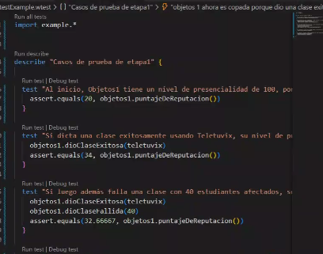
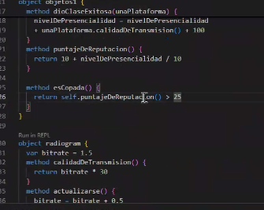

# Migración de Plataforma (chau zoom)

## Parte 1: Puntaje de reputación
Hacer un sistema en wollok que modele a la cátedra de Objetos1 y las distintas plataformas de videollamadas que puede usar para el dictado de sus clases virtuales.

El sistema tiene dos casos de uso principales: 
* Indicar que Objetos1 dictó exitosamente una clase usando una plataforma (aclarando cuál de ellas)
* Indicar que Objetos1 falló al dar una clase (indicando cantidad de estudiantes afectados). 

Lo que nos interesa de Objetos1 es conocer su puntaje de reputación. Este valor depende del nivel de presencialidad. 

* Cuando objetos1 falla una clase, su nivel de presencialidad disminuye en `cantidad de estudiantes afecados / 3` 
* Cuando objetos1 dicta exitosamente una clase, su nivel de presencialidad aumenta en `100 + nivel de calidad de transmisión de la plataforma (un número)` 
* El puntaje de reputación se calcula como `10 + nivel de presencialidad / 10`

objetos1 comienza con 100 de nivel de presencialidad.

Existen 2 plataformas de momento, pero puede haber más en el futuro

* Radiogram, cuya calidad de transmisión es `bitrate * 30`. Al inicio tiene 1.5 de bitrate, pero puede actualizarse y mejorar en 0.5 cada vez. 
* Teletuvix, cuya calidad de transmisión es 40, siempre.

Nota: Acá se trabaja polimorfismo, ordenes, consulta y estado del objeto.

### Casos de prueba

Acá vamos a verificar mediante los test de wollok si nuestro código está correcto. Para este ejercicio vamos a escribirlos como si se tratara de una historia, y por ahora se repetirá código en cada uno de los test, más adelante veremos como evitar eso:

- Al inicio, Objetos1 tiene un nivel de presencialidad de 100, por lo tanto su reputación es 20
(10 + 100 / 10)
- Si dicta una clase exitosamente usando Teletuvix, su nivel de presencialidad pasa a ser 240, y su reputación es 34 (100 + 100 + 40 = 240 → 10 + 240 / 10)
- Si luego además falla una clase con 40 estudiantes afectados, su nivel de presencialidad pasa a ser 230, y su reputación es 33 (240 - 40/4 = 230 → 10 + 230 / 10)
- Luego dicta una clase exitosamente usando Radiogram (bitrate 1.5), su nivel de presencialidad pasa a ser 375, y su reputación es 47.5 (calidad = 1.5 * 30 = 45 → 230 + 100 + 45 = 375)
- Más tarde, Radiogram mejora su bitrate a 2.0 y luego se dicta otra clase exitosa, el nivel de presencialidad pasa a ser 535, y su reputación es 63.5 (calidad = 2.0 * 30 = 60 → 375 + 100 + 60 = 535)
- Y por último, falla una clase con 100 estudiantes afectados, su nivel de presencialidad pasa a ser 510, y su reputación es 61 (535 - 100/4 = 510 → 10 + 510 / 10)

## Parte 2:  Del dicho al hecho

Para poder dictar una clase, se agrega un requisito: El puntaje de reputación debe ser como mínimo 10. 
La cátedra debe entender el mensaje recuperarse al fallar una clase:
Para eso falla una clase, y luego, si cumple el requisito, dicta clase exitosa en una nueva plataforma 

Nota: Acá se busca ser capaz de evitar la duplicación de código (subtareas), 
y manejar correctamente métodos booleanos de consulta.

## Parte 3: Se amplían las plataformas

Agregar una nueva plataforma (inventada), respetando polimorfismo.

## Casos de prueba

Desarrollar distintos casos de prueba para demostrar que funcionan correctamente los métodos.

